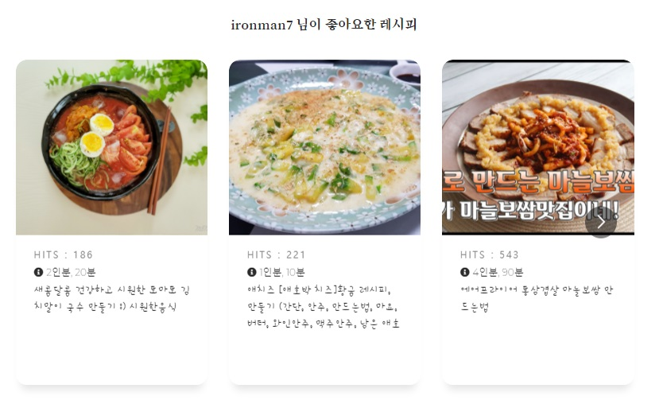

# NAMORE - 나의 모든 레시피

#### 사용자 기반 협업 알고리즘을 통한 레시피 추천 서비스

## 프로젝트 소개

나모레는 사용자 기반 협업 알고리즘을 통한 레시피 추천 서비스입니다.

회원가입을 할 때 유저가 좋아하는 음식 재료와 싫어하는 음식 재료를 입력받고 이 재료를 기반으로 레시피를 추천해줍니다.

사이트 내에서 추천, 검색, 나의 냉장고, 인기메뉴 기능을 통해 활동을 하게 되면 그 활동 내역을 기반으로 나와 비슷한 평가를 한 유저들에게 만족도가 높은 레시피를 추천해줍니다.

- 검색 - 찾고싶은 요리 이름을 입력하면 레시피를 알려줍니다.
- 나의 냉장고 - 내가 지금 가지고 있는 재료를 입력하면 재료들로 어떤 음식을 만들 수 있는지 알려줍니다.
- 인기메뉴 - 평점이 높은 순서대로 레시피를 알려줍니다.

## Frontend

### 라우터 분리

- /Home

  - 풀페이지 스크롤

    1. 비로그인 상태 첫 화면
    2. 로그인 페이지: 회원가입 페이지(/Signup)와 연결

  - 화면구성

    - 홈 화면

      

- /Signup

  - 회원가입 페이지

  - 회원가입 양식

    - 필수: 사용자 이름, 비밀번호, 비밀번호 확인, 이메일 주소
    - 선택: 성별, 나이

  - 필수정보 작성 완료 후 추천에 필요한 재료 정보 입력받음

  - 모두 입력 완료 후 자동으로 로그인되어 /Main으로 리다이렉트

  - 화면구성

    - 회원가입 - 기본 정보 입력

      

    - 회원가입 - 재료 정보 입력

      

- /Main

  - 로그인 상태 첫 화면

  - 상단 네비게이션 바와 검색창이 있는 헤더가 위치

    - 네비게이션 바: /Mypage 또는 /Main으로 즉시 이동 가능

    - 검색창: 제목에 검색 키워드가 포함된 레시피를 찾아 /Search/(키워드) 에서 보여줌

  - 주요 서비스인 4가지 방식의 추천 레시피 페이지를 확인할 수 있는 탭 

    - ForYou (기본값): 비슷한 취향의 사용자 데이터를 바탕으로 추천받은 레시피
    - Favorite (/Favorite): 가입 단계에서 입력받은 선호/기피를 바탕으로 추천받은 레시피
    - Refrigerator (/Material): 현재 보유하고 있는 재료를 입력하면 해당 재료들로 조리 가능한 레시피 추천
    - Popularity (/Top): 레시피 DB에서 가장 높은 조회수를 기록중인 레시피 추천

  - 레시피 리스트와 카드를 보여주는 탭

    - 레시피 리스트 : Row, Col을 활용하여 반응형 카드 리스트
    - 카드 : 이미지 클릭시 디테일 페이지로 이동

  - 화면구성

    - 메인 헤더

      

    - 카테고리별 레시피 리스트

      

- /Recipe/(레시피 #)

  - 레시피 상세 페이지

  - 포함 정보: 조리 시간, 양, 난이도, 필요 재료, 단계별 사진과 설명

  - 마음에 드는 레시피를 직접 조리해본 뒤 평가할 수 있도록 레시피를 저장할 수 있는 버튼

  - 저장한 레시피는 /Mypage 에서 확인할 수 있으며 '찜 목록' 버튼을 통해 즉시 이동 가능

  - 댓글 기능 제공

  - 상단 '댓글보기' 버튼으로 하단 댓글 스크롤 위치까지 바로 이동 가능하게 구현 (레시피 단계별 정보가 많을 경우를 고려)

  - 상단 '뒤로가기'에 history 기능을 사용하여 브라우저의 뒤로가기 버튼을 누르기 않고도 바로 전 페이지로 이동 가능

  - 화면구성

    - 레시피 정보

      

    - 좋아요 및 댓글

      

- /Mypage

  - 가입시 작성했던 기본 정보와 재료 정보를 수정할 수 있음

  - 좋아요 누른 레시피들을 한 눈에 보여줌

  - 나만의 추천을 위해 저장된 각 레시피에 대해 난이도, 맛, 뒷정리, 재도전 의향 4가지 측면에서 평가할 수 있음

  - Carousel, 평점카드 두 가지 섹션으로 나눠 사용자가 전체 리스트를 Carousel로 확인하고, 하단에서 평점을 부여할 수 있도록 구성 

  - 화면구성

    - 마이페이지 헤더

      

    - 나의 리스트 Carousel

      

    - 평점카드

      

## Backend

### 추천 알고리즘

1.  냉장고 재료에 따른 레시피 추천 알고리즘

   (/backend/views.py/Recommend_RefriAPI)

   - 선택된 유저의 기피재료를 기반으로 레시피 1차 선별
   - 냉장고 재료에 따른 레시피 선별
     - 레시피 재료에 냉장고 재료가 포함되어 있는지
     - 레시피 이름에 냉장고 재료가 포함되어 있는지.
   - 상기 방법에 따라 레시피에 카운트를 적용하여 최종 선별

2.  선호 재료에 따른 레시피 추천 알고리즘
   	(/backend/views.py/Recommend_LikeAPI)

   - 선택된 유저의 기피재료를 기반으로 레시피 1차 선별
   - 선호 재료에 따른 레시피 선별
     - 레시피 재료에 선호 재료가 포함되어 있는지
     - 레시피 이름에 선호 재료가 포함되어 있는지.
   - 상기 방법에 따라 레시피에 카운트를 적용하여 최종 선별

3.  조회수에 따른 레시피 추천 알고리즘
   	(/backend/views.py/Recommend_HitAPI)

   - 선택된 유저의 기피재료를 기반으로 레시피 1차 선별
   - 레시피 조회수에 따라 레시피 최종 선별

4.  협업시스템에 따른 레시피 추천 알고리즘
   	(/backend/views.py/Recommend_RankAPI)

   - 유저가 좋아요 한 레시피에 4개의 평점을 작성 (난이도, 맛, 뒷정리, 재사용)
   - 로그인 한 유저가 평가한 레시피의 정보를 추출
   - 해당 정보를 기반으로 타 유저가 작성한 평점과 비교
   - 비교 점수를 기반으로 나와 알맞는 유저를 선정
   - 최종 선정 된 유저가 평가한 레시피 중 내가 평가하지 않은 레시피 추천

### API

[User]

- User register 
  - URL : http://j3d102.p.ssafy.io/api/auth/register/  [POST]
  - username, password, email, user_gender, user_age 전달

- User login
  - URL : http://j3d102.p.ssafy.io/api/auth/login/  [POST]
  - username, password 전달
  - Token 생성됨
- User data
  - URL : http://j3d102.p.ssafy.io/api/auth/user/  [GET]
  - Login 후 생성된 Token 전달
- User data edit
  - URL : http://j3d102.p.ssafy.io/api/auth/user/profile/  [PUT]
  - Login 후 생성된 Token과 함께 변경사항 전달
  - password, email, user_gender, user_age 변경 가능

[Recipe]

- 모든 Recipe 정보
  - URL : http://j3d102.p.ssafy.io/api/recipe/  [GET]
- Recipe Card
  - URL : http://j3d102.p.ssafy.io/api/recipe/card/  [GET]
  - 카드형태 구현을 위한 Recipe 정보
- Recipe Detail
  - URL : http://j3d102.p.ssafy.io/api/recipe/<recipe_pk>/  [GET]
  - recipe_pk에 해당하는 자세한 Recipe 정보
- Recipe Search
  - URL :  http://j3d102.p.ssafy.io/api/recipe/search/  [POST]
  - 원하는 검색어를 wantName로 전달
- User like recipe
  - URL : http://j3d102.p.ssafy.io/api/auth/user/recipe/ 
  - [GET]
    - Login 후 생성된 Token 전달
    - User가 좋아요를 누른 모든 Recipe 전달
  - [POST]
    - Login 후 생성된 Token과 함께 좋아요를 누르거나 취소할 recipe_pk 전달
    - User의 recipe_like 수정
- User like recipe for Card
  - URL : http://j3d102.p.ssafy.io/api/auth/user/recipe/kangmin/  [GET]
  - Login 후 생성된 Token 전달
  - Card 구성을 위한 recipe 정보 확인 

[Rank]

- User recipe rank
  - URL : http://j3d102.p.ssafy.io/api/rank/  
  - [GET]
    - Login 후 생성된 Token 전달
    - User가 좋아요 눌렀던 Recipe의 모든 Rank 정보 확인
  - [POST]
    - Login 후 생성된 Token과 함께 recipe_pk, rank_difficulty, rank_flavor, rank_clean, rank_reuse 전달
    - recipe_pk에 해당하는 Recipe의 rank 정보 수정
- Rank detail
  - URL : http://j3d102.p.ssafy.io/api/rank/kangmin/<recipe_pk>/  [GET]
  - Login 후 생성되는 Token과 함께 recipe_pk 전달
  - recipe_pk에 해당하는 Recipe에 입력했던 Rank 확인

[ingredient]

- 모든 ingredient 정보
  - URL : http://j3d102.p.ssafy.io/api/ingre/  [GET]
- Refrigerator Ingredient
  - URL : http://j3d102.p.ssafy.io/api/auth/refri/
  - [GET]
    - Login 후 생성된 Token 전달
    - User가 입력했던 냉장고 속 재료 확인
  - [POST]
    - Login 후 생성된 Token과 함께 냉장고 속 재료 변경사항 전달
    - 냉장고 속 재료 업데이트
- Hate Ingredient
  - URL : http://j3d102.p.ssafy.io/api/auth/hate/
  - [GET]
    - Login 후 생성된 Token 전달
    - User가 입력했던 기피 재료 확인
  - [POST]
    - Login 후 생성된 Token과 함께 기피 재료 변경사항 전달
    - 기피 재료 업데이트
- Like Ingredient
  - URL : http://j3d102.p.ssafy.io/api/auth/like/
  - [GET]
    - Login 후 생성된 Token 전달
    - User가 입력했던 선호 재료 확인
  - [POST]
    - Login 후 생성된 Token과 함께 선호 재료 변경사항 전달
    - 선호 재료 업데이트

[Comment]

- User comment

  - URL : http://j3d102.p.ssafy.io/api/auth/comment/  [GET]
  - Login 후 생성된 Token 전달
  - User가 작성한 모든 Comment 확인

- Recipe comment

  - URL : http://j3d102.p.ssafy.io/api/recipe/<recipe_pk>/comment/  [GET]
  - recipe_pk에 해당하는 Recipe에 작성된 모든 Comment 확인

- Comment create/edit

  - URL : http://j3d102.p.ssafy.io/api/comment/
  - Comment Create  [POST]
    - Login 후 생성된 Token과 함께 recipe_pk, comment_content 전달
  - Comment Edit  [PUT]
    - Login 후 생성된 Token과 함께 comment_pk, comment_content 전달

- Comment delete

  - URL : http://j3d102.p.ssafy.io/api/recipe/<recipe_pk>/comment/<comment_pk>/

    - Login 후 생성된 Token과 함께 recipe_pk, comment_pk 전달

--------------

#### 개발 스택

##### 협업

- Jira
- GitLab 
- Mattermost

##### DB

- Django
- SQLight3

##### Framework

- React
- Django
- Node JS

---

### SSAFY 3기 구미 1반 D102 - 사랑합니다 부른 Team 

- Frontend
  - `이동규` 
  - `배병준`
  - `박강민`
- Backend
  - `전상혁`
  - `정광수`
  - `한광욱`
